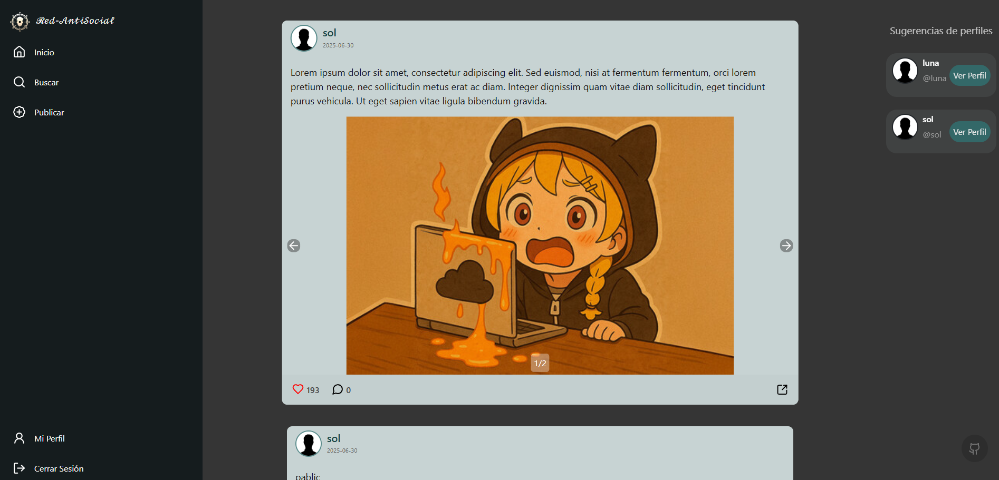

# 🧠 UnaHur Anti-Social Net

Una red social minimalista desarrollada con React, como parte del trabajo práctico final de la materia **Construcción de Interfaces de Usuario** (CIU) en la UNAHUR.  
Permite a los usuarios registrarse, iniciar sesión, crear publicaciones con imágenes y etiquetas, y comentar en publicaciones de otros usuarios.

## 📌 Tabla de contenidos

- [⚙️ Instalación](#%EF%B8%8F-instalación)
- [🚀 Tecnologías utilizadas](#-tecnologías-utilizadas)
- [📲 Funcionalidades principales](#-funcionalidades-principales)
- [🌐 API utilizada](#-api-utilizada)
- [🧑‍💻 Autores](#-autores)


## ⚙️ Instalación
1. Instalación de Back-end: `https://github.com/lucasfigarola/backend-api.git`

2. Instalación de Front-end:

```bash
# 1. Clonar el repositorio
git clone https://github.com/Leonardodb611/Proyecto-final-CIU.git

# 2. Instalar dependencias
cd proyecto-final-ciu
npm install

# 3. Iniciar el servidor de desarrollo
npm run dev
```

## 🚀 Tecnologías utilizadas

- ⚛️ React
- 📦 React-Router-DOM
- 🎯 useState, useEffect, useContext
- 🌐 Fetch API
- 💾 localStorage
- 🎨 CSS + Bootstrap + Lucide-Icons + React-toastify
- 🔒 Validaciones básicas de formularios

## 📲 Funcionalidades principales

### 👤 Registro de usuario

- Vista `/register/`
- Formulario de registro con validación de nickname y email.
- Registro con `POST /users`

### ✅ Inicio de sesión (simulado)

- Vista `/login/`
- Login con nickname existente + contraseña fija: `123456`
- Verificación del usuario vía `GET /users`
- Validación local de la contraseña
- Persistencia con `localStorage` y `Context`


### 🏠 Página principal (Home)
- Vista `/home/`
- Feed con publicaciones:
  - Imagen de perfil (simulado)
  - Nickname del perfil (con acceso al perfil del usuario)
  - Fecha de publicacion
  - Descripción
  - Imágenes (si existen)
  - Cantidad de likes (simulados)
  - Cantidad de comentarios visibles
  - Comentar desde una publicacion.
  - Botón **"Ver publicación"** para ir al detalle del post
- Sugerencias de perfiles:
  - Nickname
  - Atajo para ver perfil del usuario




### 💬 Detalle de publicación

- Vista `/post/:id`
- Muestra:
  - Descripción completa
  - Imágenes asociadas (si existen)
  - Etiquetas (si existen)
  - Comentarios visibles (si existen)
  - Cantidad de likes (simulados)
- Agregar comentario nuevo


### 🙍 Perfil de usuario (ruta protegida)

- Muestra datos del usuario logeado(foto de perfil, email, nickname)
- Muestra publicaciones del usuario logeado

### 📝 Crear nueva publicación (ruta protegida)
- Formulario controlado:
  - Descripción (obligatoria)
  - URLs de imágenes (opcionales) divididas por una coma
  - Selección de etiquetas
- Redirección a `/home`

## 🧪 Extras implementados (bonus)

  - Busqueda por etiquetas, por descripción de publicación, y por nickname de usuario
  - Paginación + scroll infinito
  - Animaciones suaves
  - Alertas visuales (éxito/error)

## 🌐 Api utilizada 

Se utiliza la API provista por cátedra para simular el backend de la red social:
🔗 https://github.com/lucasfigarola/backend-api

## 🧑‍💻 Autores
- Arias Lavia, Luana
- Bravo, Mario Álvaro F.
- De Biase, Leonardo
- Droegue, Lucas
- Lera Centurion, Brenda